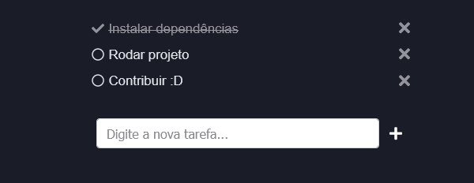

# todo-app-vue
To-do list funcional feito em vue.js.

Aplicação simples onde você pode adicionar, remover e concluir tarefas. **Uma aplicação 100% funcional e pronta para o uso.**   
Os dados _são salvos no localStorage, então mesmo que seja feito um refresh da tela ou feche o browser seus dados não serão perdidos pois ficam salvos no seu browser._

URL para acessar a aplicação: https://pedrogustavo.github.io/todo-app-vue/



## Rodando o projeto local
Para rodar o projeto, basta acessar o diretório raiz e instalar as dependências utilizando:
```
npm install
```

### Rodando o projeto com hot-reload para desenvolvimento
```
npm run serve
```

### Compilando e minificando para produção
```
npm run build
```

### Linter
```
npm run lint
```
## Construído com
- [vue-cli](https://cli.vuejs.org/)
- [vue.js v2.x.x](https://vuejs.org/)
- [vueX](https://vuex.vuejs.org/)
- [vue-router](https://router.vuejs.org/)
